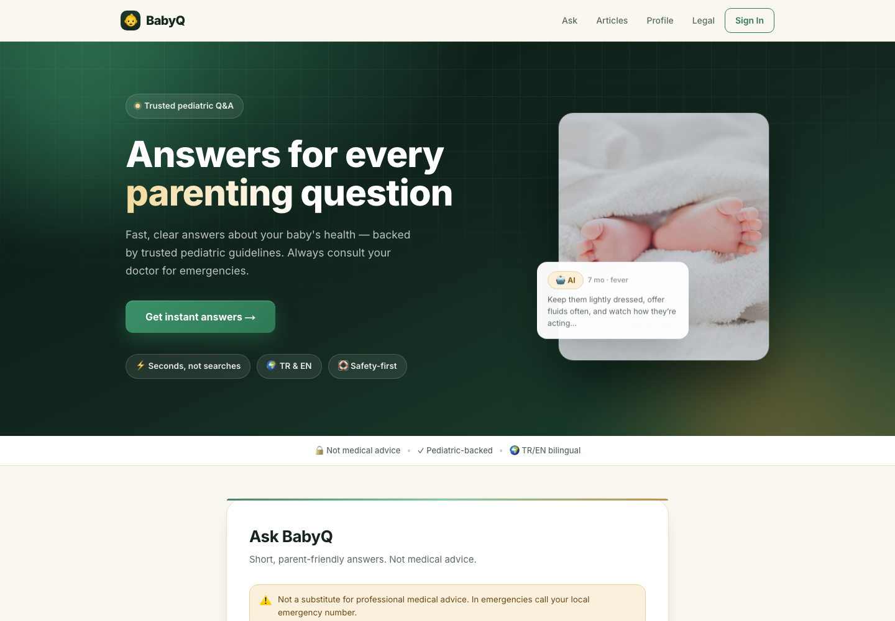
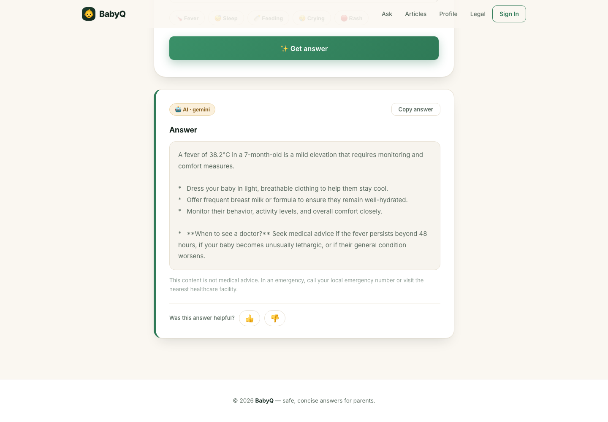
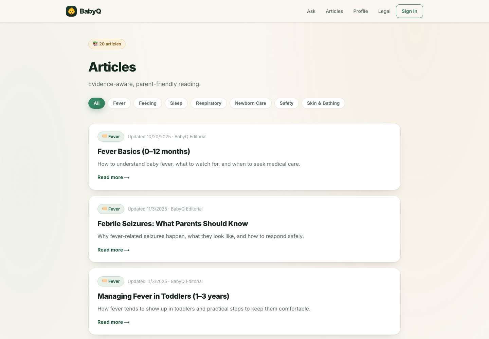

# BabyQ 👶

**AI-powered pediatric Q&A assistant for parents** — ask a question about your baby's symptoms and get a short, safe, parent-friendly answer in seconds, backed by rule-based emergency detection, a curated FAQ knowledge base, and Google Gemini as a fallback reasoning layer.

> ⚠️ BabyQ does not provide medical advice or diagnoses. It is a triage/information aid that always defers to professional care for urgent symptoms.

**Live demo:** https://babyq.app/

---

<p align="center">
  
  
</p>
<p align="center">
  
</p>

---

## Why this project

Parents often turn to search engines at 2 a.m. with vague, anxious questions about a fever or a rash. BabyQ explores what a lightweight, safety-first triage layer could look like: deterministic rules catch red-flag symptoms first, a small FAQ dataset handles common questions cheaply, and an LLM only fills the gap for everything else — with a multi-model fallback chain so a single provider outage doesn't take the feature down.

## Features

- **Ask flow** — enter baby's age, sex, and a free-text concern; get a structured answer (summary, actionable tips, "when to see a doctor").
- **Three-tier answer resolution**: `RULES → FAQ → AI`, in that priority order:
  1. **Emergency rules** run first (age + temperature + red-flag keyword detection in TR/EN) and short-circuit straight to an urgent-care warning — no LLM round-trip, no delay.
  2. **FAQ matching** scores a Supabase-backed FAQ table by age range and keyword overlap.
  3. **Gemini fallback chain** (`gemini-flash-lite-latest` → `gemini-flash-latest` → `gemini-pro-latest`, Google's self-updating model aliases) generates a grounded answer using the top FAQ matches as context, with a shorter retry prompt if the first call fails.
- **Bilingual (TR/EN)** — auto language detection from input text (with `?lang=` override), covering UI copy, prompts, and disclaimers.
- **Auth & multi-baby profiles** — Supabase email/password auth; logged-in users can save more than one child, pick who a question is about on the Ask page, and get persisted question history (guests fall back to `localStorage`).
- **Articles library** — 20 editorially-written reference articles across 7 categories (fever, feeding, sleep, respiratory, newborn care, safety, skin & bathing) with sources.
- **Product analytics** — PostHog-instrumented activation funnel (`$pageview` → `ask_started` → `answer_received` → `signup_completed`).
- **PWA** — installable, offline-capable via `manifest.json` + service worker.
- **Feedback loop** — thumbs up/down on AI answers, stored for future quality review.

## Architecture

```
┌─────────────┐      ┌──────────────────────┐      ┌───────────────┐
│  app/page.tsx │ ───▶ │  POST /api/ask       │ ───▶ │ Supabase       │
│  (Ask form)   │      │                      │      │ (faqs,         │
└─────────────┘      │  1. emergency rules   │      │  questions,    │
                       │  2. FAQ scoring      │◀─────│  profiles,     │
                       │  3. Gemini fallback  │      │  feedback)     │
                       └──────┬───────────────┘      └───────────────┘
                              │
                              ▼
                    Google Gemini API
           (flash-lite-latest → flash-latest → pro-latest)
```

- **`app/api/ask/route.ts`** — core decision logic: language detection, urgency/temperature parsing, FAQ scoring, Gemini calls with a resilient multi-model + retry chain, and best-effort persistence of every Q&A to Supabase.
- **`app/api/feedback/route.ts`** — records helpful/not-helpful signal per answer.
- **`app/api/health/route.ts`** — reports which required env vars are present (booleans only, no secrets) for deployment diagnostics.
- **`lib/supabaseServer.ts`** / **`lib/supabaseBrowser.ts`** — separate service-role (server-only) and anon-key (browser) Supabase clients; the browser client degrades to `null` gracefully if env vars are missing instead of crashing the app.
- **`lib/useAuth.ts`** — thin hook around Supabase auth (session, sign in/up/out).
- **`lib/useI18n.ts`** — TR/EN copy dictionary + language hook shared across pages.

## Tech Stack

| Layer | Choice |
|---|---|
| Framework | Next.js 15 (App Router, Turbopack) |
| UI | React 19, TypeScript, Tailwind CSS v4 |
| Auth & DB | Supabase (Postgres, email/password auth) |
| AI | Google Gemini (`flash-lite-latest` / `flash-latest` / `pro-latest`) |
| Analytics | PostHog (activation funnel, autocapture) |
| Deployment | Vercel |
| PWA | Web App Manifest + custom service worker |

## Getting Started

### Prerequisites
- Node.js 20+
- A [Supabase](https://supabase.com) project
- A [Google AI Studio](https://aistudio.google.com/) API key for Gemini

### Setup

```bash
git clone https://github.com/DidemKurtErsoy1/babyq.git
cd babyq
npm install
```

Create a `.env.local` file:

```bash
# Server-side (Supabase service role — never exposed to the browser)
SUPABASE_URL=https://your-project.supabase.co
SUPABASE_SERVICE_ROLE_KEY=your-service-role-key

# Client-side (Supabase anon key — safe to expose)
NEXT_PUBLIC_SUPABASE_URL=https://your-project.supabase.co
NEXT_PUBLIC_SUPABASE_ANON_KEY=your-anon-key

# AI
GEMINI_API_KEY=your-gemini-api-key

# Analytics (optional — omit to run without PostHog)
NEXT_PUBLIC_POSTHOG_KEY=your-posthog-project-key
NEXT_PUBLIC_POSTHOG_HOST=https://eu.i.posthog.com
```

Run the SQL in [`supabase/migrations`](supabase/migrations) (in order) via the Supabase SQL Editor to create the `faqs`, `questions`, `feedback`, `profiles`, and `babies` tables with Row Level Security policies, plus a small seed set of FAQs.

```bash
npm run dev
```

Open [http://localhost:3000](http://localhost:3000). Visit `/api/health` to confirm which env vars are detected.

## Project Structure

```
app/
├── page.tsx              # Ask page (main form + AI/FAQ/fallback response)
├── login/                # Email/password auth
├── history/              # Per-user Q&A history (auth-gated)
├── profile/              # Baby profile (Supabase or localStorage)
├── articles/              # Static article library
├── legal/                # Medical disclaimer
└── api/
    ├── ask/               # Core AI consultation endpoint
    ├── feedback/          # Answer feedback
    └── health/            # Env var diagnostics
lib/
├── supabaseServer.ts      # Service-role client (server-only)
├── supabaseBrowser.ts     # Anon-key client (browser, singleton)
├── useAuth.ts             # Auth hook
└── useI18n.ts             # TR/EN copy + language hook
```

## Roadmap / Known Limitations

- No automated test suite yet (candidate: Vitest for `app/api/ask` decision logic — rules, urgency detection, language detection are pure functions and cheap to unit test).
- No CI pipeline (lint/typecheck/build on PR).
- Articles are static data, not DB-backed.
- `openai` dependency is installed but unused (Gemini is the only active provider).

## Disclaimer

BabyQ is a portfolio/demo project. It is **not a certified medical device** and must not be used as a substitute for professional pediatric care. In an emergency, always contact your local emergency number or nearest healthcare facility.
